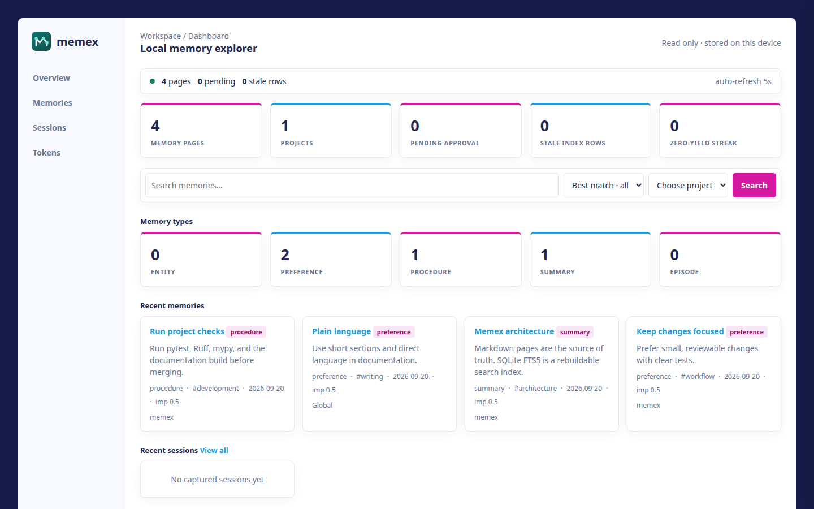

<div align="center">


**A durable, local-first memory layer for AI coding agents.**

The filesystem is the memory · the index is disposable · every session is provable.

[](https://github.com/phanijapps/memex/actions/workflows/ci.yml)
[](https://github.com/phanijapps/memex/actions/workflows/docs.yml)
[](LICENSE)
[](pyproject.toml)
[](https://phanijapps.github.io/memex/)

[Documentation](https://phanijapps.github.io/memex/) · [User guide](docs/gitpages/guide.md) · [Harness adapters](marketplace/)

</div>

---

## Overview

Agents forget your stack, rules, and past decisions. Memex keeps that knowledge
in local files and brings relevant memories into coding sessions.

- **Markdown is the memory.** Each page under `~/.memex/docs/` is readable,
  editable, portable, and suitable for version control.
- **Search is rebuildable.** SQLite FTS5 provides BM25 search;
  `memex rebuild-index` restores the index from the pages.
- **Sessions are traceable.** Captured transcripts link to episode memories,
  so you can find the conversation behind a memory.

Memex combines model-initiated MCP tools, harness hooks that inject context and
capture transcripts, and `memex verify` for CI checks. The same memory store
works with pi, Claude Code, Codex, and GitHub Copilot.

## Quick start

### Install Memex from Git

Requires Python 3.12+ and [uv](https://docs.astral.sh/uv/getting-started/installation/).
Install the CLI directly from GitHub; a source checkout is optional.

```bash
uv tool install git+https://github.com/phanijapps/memex.git
```

### Connect your coding agent

Run the command for your harness from the project where you want Memex:

```bash
memex install claude       # Claude Code
memex install codex        # Codex
memex install pi           # pi
memex install copilot      # GitHub Copilot
```

`memex install` opens an interactive picker. See the [harness guide](docs/gitpages/guide.md#harness-integration)
for what each adapter installs and how it captures sessions.

### Store and recall a memory

```bash
memex write --type preference --title "Deploy on Fridays" \
    --body "The team deploys to production on Fridays only." --tags deploy
memex recall "deploy"
```

The page is a plain file at
`~/.memex/docs/global/preferences/deploy-on-fridays.md`. For repository
architecture, conventions, and decisions, use `--scope project`; Memex can
derive the project identity from the working directory. See
[project memory](docs/gitpages/guide.md#project-memory-and-dashboard) for scope details.

### Explore your memory

Run `memex viz` to open the local, read-only dashboard. It shows memory pages,
projects, sessions, token usage, and index health.



[See the Memories view](docs/gitpages/assets/dashboard-memories.png) for scope
and type filters. These screenshots use sample data.

### Remove Memex

Run `memex uninstall <name>` from each project where you installed an adapter.
It removes that harness's Memex wiring and keeps your memories. Then remove
the CLI if you no longer need it:

```bash
memex uninstall claude     # repeat for each installed harness
uv tool uninstall memex    # remove the CLI
```

Memories and transcripts remain under `~/.memex/` unless you remove that
directory separately.

## More ways to use Memex

| Command | Purpose |
|---|---|
| `write` / `recall` | Store and search memory pages |
| `forget` | Retire, archive, decay, or delete a memory |
| `consolidate` | Distill session episodes into durable memories |
| `viz` | Browse memories and sessions in the local dashboard |
| `verify` | Check store health and optional recall/write activity in CI |
| `rebuild-index` / `watch` | Pick up hand edits to Markdown pages |
| `backup` / `restore` / `export` / `import` | Archive the store or move JSON nodes |

The [user guide](docs/gitpages/guide.md) covers commands, transcripts,
provenance, scope, configuration, and data safety. The
[specification](docs/gitpages/spec.md) and
[implementation notes](docs/gitpages/implementation-notes.md) cover the full
contract and shipped differences.

<details>
<summary><strong>Python API</strong></summary>

```python
from memex import Memex, WriteInput

memex = Memex()
memex.write(WriteInput(type="entity", title="Ruff linter", body="Fast linter."))
result = memex.recall("linter", top_k=3)
provenance = memex.get_provenance(result.hits[0].slug)
memex.close()
```
</details>

<details>
<summary><strong>MCP and CI</strong></summary>

The installed harness adapter registers `memex serve-mcp` where supported.
For a manual Claude Code setup:

```bash
claude mcp add memex -- memex serve-mcp
```

`memex verify` always checks that pages parse, the index matches them, and
links resolve. Add a time cutoff to require memory activity in CI:

```bash
memex verify --since "$PR_CREATED" --require-recall --require-write
```

The [Copilot workflow](marketplace/copilot/memex-verify.yml) is a ready-made example.
</details>

## Development

### Architecture

The CLI, MCP server, and harness adapters use the same application services.
Those services write Markdown pages, maintain the disposable SQLite search
index, and capture session JSONL. The optional dashboard reads this store.
See the [architecture overview](docs/architecture/overview.md) for code
ownership and runtime flows.

### Work from a clone

```bash
git clone https://github.com/phanijapps/memex.git
cd memex
uv sync --all-groups
```

To install your checkout as the `memex` CLI, run `uv tool install . --force`.

### Test and contribute

```bash
uv run pytest
uv run ruff check .
uv run ruff format --check .
uv run mypy src tests
uv run mkdocs build --strict
```

Contributions welcome. Read [AGENTS.md](AGENTS.md) for repository conventions
and the [user guide](docs/gitpages/guide.md) for behavior and configuration.

## License

[MIT](LICENSE) © Memex contributors
