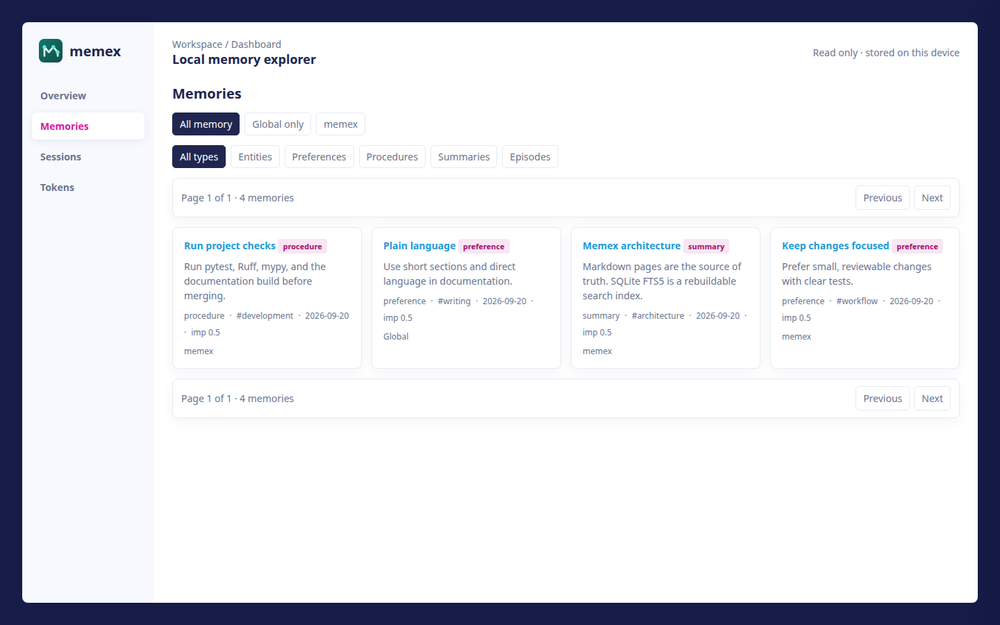

# Memex user guide

Everything you need to run memex for yourself, your agent, or your team.

- [Concepts](#concepts)
- [Getting started](#getting-started)
- [Operations](#operations)
- [Descriptions and directory indexes](#descriptions-and-directory-indexes)
- [Transcripts and provenance](#transcripts-and-provenance)
- [Harness integration](#harness-integration)
- [Deterministic checks (CI)](#deterministic-checks-ci)
- [Data portability](#data-portability)
- [Configuration reference](#configuration-reference)
- [Data safety](#data-safety)

## Concepts

**The memory store is the filesystem.** Every memory is a Markdown page under
`~/.memex/docs/`, with YAML front matter and a Markdown body. Pages are
human-readable, git-able, and editable by hand in any editor. If you edit a
page externally, `memex rebuild-index` (or `memex watch`) picks it up.

**Every page is an OKF v0.2 concept.** Front matter declares
`okf_version: "0.2"` and carries the Open Knowledge Format fields first — in
the order the OKF reference implementation writes them — followed by the
Memex fields OKF has no equivalent for. An OKF tool reads the store as a
valid bundle and preserves the Memex fields untouched.

| OKF field | Meaning |
|---|---|
| `type` | One of entity, preference, procedure, summary, episode |
| `title`, `description` | Name and one-line signpost |
| `resource` | Canonical URI of the underlying asset, when there is one |
| `tags` | Lowercased, deduplicated labels |
| `timestamp` | Refreshed on every write |
| `valid_from`, `valid_until` | The validity window recall honours |
| `stale_after` | Advisory staleness; never hides a page |
| `updated_at` | Moves only when the body actually changes |
| `parent`, `supersedes`, `implements`, `depends_on` | Relations, as slugs |
| `links` | Typed relations: `[{target: "slug", rel: "relates-to"}]` |

The Memex block that follows carries `id`, `created`, `importance`,
`access_count`, `last_access`, `content_hash`, `status`, `occurred_at`,
`source`, `harness`, `confidence`, `scope`, `project_id`, `project_label`,
`session_id`, and `transcript_ref`.

A `[[slug]]` reference in the body is a graph edge with the relation
`mentions`; it is not copied into front matter.

```
~/.memex/
├── docs/
│   ├── index.md         # generated navigation view (disposable)
│   ├── global/          # shared memories, grouped by type
│   │   ├── entities/
│   │   ├── preferences/
│   │   ├── procedures/
│   │   ├── summaries/
│   │   └── episodes/
│   └── projects/        # project memories, grouped by readable project folder
│       └── git-memex/
│           ├── preferences/
│           └── episodes/
├── transcripts/         # raw session JSONL + metadata
├── mem.db               # disposable BM25 index (rebuildable)
├── memex.toml           # configuration
└── logs/                # operation audit trail (no memory contents)
```

**Concept types.** Every page has a `type`, and a type is one of three kinds
(ADR-0006). The directory is the declaration: a type exists for a project
exactly when `projects/<project>/<type>/` exists on disk, and its `log.md`
records who declared it, when, and why.

| Kind | Who defines it | What it carries | Examples |
|---|---|---|---|
| Built-in | memex | behaviour — capture writes `episode`, consolidation writes `summary` | `entity`, `preference`, `procedure`, `summary`, `episode` |
| Catalogue | memex; a project turns it on | a contract — authorship, aging, supersession | `domain`, `architecture`, `rule`, `policy`, `decision` |
| Custom | a project declares it, or the model nominates it as a draft | a shelf and a heading | `access-matrix`, `story-map` |

The five built-ins keep their historical plural directories
(`entities/`, `preferences/`, `procedures/`, `summaries/`, `episodes/`) and
their behaviour unchanged; catalogue and custom types are project-scoped and
use their own name as the directory name (`decision/`, `access-matrix/`).
**Memory decays, knowledge does not** — catalogue pages are exempt from
recency decay, since a policy nobody recalled for six months is not less
true; built-in and custom pages still age. **Memory is automatic, knowledge
is governed** — `episode`
and `summary` are always `active` on write; every other type is `active`
when a person writes it and `pending` when a model does, unless
`knowledge_approval = "auto"` (see
[Page status and approval](#page-status-and-approval)).

Manage a project's types with `memex types`:

```bash
$ memex types enable decision --project-id <id>
{"name": "decision", "kind": "catalogue", "description": "what was chosen, when, and why", "pages": 0, "directory": ".../projects/<id>/decision"}

$ memex types add access-matrix --project-id <id> --description "Who can edit what"
{"name": "access-matrix", "kind": "custom", "description": "Who can edit what", "pages": 0, "directory": ".../projects/<id>/access-matrix"}

$ memex write --type decision --title "Choose Kafka" --body "We chose Kafka over RabbitMQ for ordering guarantees." --scope project --project-id <id>
{"slug": "choose-kafka", "file_path": ".../projects/<id>/decision/choose-kafka.md"}

$ memex types list --project-id <id>
[{"name": "entity", "kind": "builtin", "pages": 0, ...}, ..., {"name": "decision", "kind": "catalogue", "pages": 1, ...}]
```

Writing an undeclared type is rejected before anything is written, on every
surface (CLI, MCP, Python, import), naming the remedy:

```
memex: undeclared type 'policy' for this project; run memex types add or memex types enable
```

A type the model discovers rather than a person declaring is a **draft**:
consolidation may nominate one through `proposed_type`, or
`memex types suggest --project-id <id>` lists tags that recur on at least
`--min-pages` (default 3) pages and are not already types, with counts and
no LLM call. A draft's directory exists and its `log.md` records the
nomination, but every page in it is `pending`, so it is invisible to recall,
injection, task recall, and navigation search until a person accepts it.
Approving, renaming, or merging a draft is a governance verb
(`memory-governance`). `memex types remove <name>` refuses while pages
exist and names the count; `--force` archives them first, then marks the
type **withdrawn**. Withdrawal is a state, not an erasure: the directory
and its `log.md` history stay on disk, `memex types list` reports it as
`kind: withdrawn`, writing to it is refused (naming the remedy), and
`memex types add` or `memex types enable` re-declares it, bringing it back
as a normal custom or catalogue type.

`log.md` is memex's own append-only record — every declaration, proposal,
and removal it writes is one line matching a fixed shape. Another tool may
write into the same file; a line that does not match that shape (for
example, free-text notes) is read as part of that file but never changes
what memex believes is declared, so it can never forge or hide a
declaration.

**Links.** Reference other pages in any body with `[[slug]]` links
(`[[Ruff Linter]]` normalizes to `[[ruff-linter]]`). Links are indexed both
directions — backlinks answer "what mentions this?".

**The index is disposable.** `mem.db` mirrors the pages for fast SQLite FTS5
search and freshness tracking. It is never the source of truth:

```bash
rm ~/.memex/mem.db
memex rebuild-index        # fully rebuilt from the memory files
```

**Temporal validity.** Recall honours one rule: the OKF validity window.
A page is invisible before `valid_from` and from `valid_until` onward
(`--include-expired` / `include_expired=True` opts back in). `stale_after`
is advisory — `memex verify` reports it, recall never acts on it.

## Getting started

Install the CLI directly from GitHub, then connect it to a coding agent from
your project directory:

```bash
uv tool install git+https://github.com/phanijapps/memex.git
memex install claude          # or codex, pi, copilot

memex write --type preference --title "Deploy on Fridays" \
    --body "The team deploys to production on Fridays only." --tags deploy
memex recall "deploy"
cat ~/.memex/docs/global/preferences/deploy-on-fridays.md
```

Run `memex install` without a name to choose a harness interactively. For
source development, clone the repository and run `uv sync --all-groups`;
`uv tool install . --force` installs that checkout as the CLI. If you rebuild
at the same version after changing source files, add `--no-cache` because uv
may reuse the earlier wheel.

Version-control your memory if you like:

```bash
cd ~/.memex/docs && git init && git add -A && git commit -m "memory: initial"
```

## Operations

### write

```bash
memex write --type entity --title "Ruff linter" \
    --body "Fast Python linter written in Rust. See also [[python-3-12]]." \
    --tags tool,lint --importance 0.8 --links python-3-12
```

- Slugs derive from titles (`Ruff linter` → `ruff-linter`), collisions get
  `-2`, `-3` suffixes. `index` and `log` are reserved: new writes never
  allocate those slugs.
- Writing an existing slug **updates** it, preserving `id`, `created`, and
  access counters.
- `importance` ∈ [0, 1]; `[[slug]]` links in the body are indexed as edges.
- `--description "One sentence."` stores an optional single-line description
  (at most 512 UTF-8 bytes) in front matter. It is searched before the body
  is read and returned on every recall hit; see
  [descriptions and directory indexes](#descriptions-and-directory-indexes).

### recall

```bash
memex recall "deploy" --top-k 5
memex recall "linting" --type preference --tag tooling
memex recall "Repair project lookup" --question "project layout" \
  --question "index rebuild" --scope project
```

- Local SQLite FTS5 over slug, title, description, body, and tags. Recall
  reduces the query
  to safe alphanumeric tokens, removes known scaffolding phrases, then runs the
  production `semantic-and-fallback-fts5` ranker: strict `AND` matching first,
  body and descriptions weighted 2x (slug, title, tags weighted 1x), and
  broad `OR` fallback only when strict matching has no hits.
- Results are deterministic and ranked best-first with short
  `<mark>`-highlighted snippets. Each hit carries the page's stored
  `description` (empty when absent) and `snippet_source` reports where the
  match was found — `body`, `description`, or `title`. A page is returned even
  when the query terms occur only in its description. Filters apply before
  limiting, returned slugs are unique, and ascending slug is the final
  tie-break.
- Filters: `--type`, `--tag` (AND semantics), `--top-k` (1–100),
  `--include-expired`. `--engine {fts5,navigation}` picks the ranker; see
  [recall without the SQLite index](#recall-without-the-sqlite-index).
- Every hit bumps its access counter — recall telemetry feeds
  [recency decay](#configuration-reference) and `verify` evidence.
- Recall stays offline and dependency-light: no embeddings, hosted search,
  runtime `rgapi`, or `rg` executable is required.

For a coding task, `--question` can be repeated one to three times. The
positional text is the task goal. Task mode searches only the current project
(or the explicit `--project-id`), spreads up to 36 distinct active pages
across the questions, and returns a context with source paths, short snippets,
questions with no eligible hits, and questions omitted by its page or 4,096 estimated
token budget. `--top-k` sets the page cap, capped at 36 in task mode, and `--max-tokens` can lower
the context budget. Global scope, expired pages, and inactive pages are not
available in task mode. Treat retrieved memory as evidence to verify, not as
instructions. MCP clients use the existing `memex_recall` tool with the task
goal in `query` and a `questions` list; its omitted `scope` derives the MCP
server's current project. Ordinary single-query recall keeps its existing
result shape.

An earlier model-written-question experiment completed 7 of 24 held-out
tasks, the same as one broad query, while a linked task summary completed 11.
Task mode requires caller-written questions and has not been shown to improve
that score. The measurements are recorded in
`docs/research/2026-09-20-task-evidence-focused-candidate.md` in the source
repository.

#### Recall without the SQLite index

`memex recall "<query>" --engine navigation` ranks the generated `index.md`
rows instead of the FTS5 index. It matches titles and descriptions only (never
page bodies), reads only the front matter of the pages it returns, supports
`--type`, `--tag`, `--scope`/`--project-id`, `--top-k`, and `--max-tokens`,
and rejects time ranges. The result's `search_engine` is
`navigation-index-md`. The default `--engine fts5` uses this path
automatically when `mem.db` holds no rows but pages exist, reporting
`navigation-index-md-fallback`; run `memex rebuild-index` to restore FTS5
ranking (and to regenerate navigation if `index.md` files are missing).

### forget

```bash
memex forget deploy-on-fridays               # hard: file deleted, irreversible
memex forget deploy-on-fridays --mode soft   # valid_until=now; hidden from recall
memex forget deploy-on-fridays --mode decay  # valid_until=now + one half-life
```

| Mode | Effect |
|---|---|
| `hard` | Deletes the page, its index row, and its links — irreversible |
| `soft` | Sets `valid_until` to now; page stays, hidden from recall by default |
| `decay` | Sets `valid_until` one configured half-life out; excluded once past |

### consolidate

The only LLM-calling operation, and only on explicit request. It reads recent
episode nodes and proposes durable entity/preference/procedure/summary nodes
(the prompt and rules live in the specification, §11).

```bash
memex consolidate --mode dry-run     # propose, write nothing
memex consolidate --max-episodes 10  # distill and write
```

Requires LLM credentials (`MEMEX_API_KEY` or `[llm]` in `memex.toml`). Works
with any OpenAI-compatible endpoint — OpenAI, Ollama, LM Studio, OpenRouter
— via one `openai`-SDK client pointed at the configured base URL.

### Token budgets and injection floor

Recall and hook injection pack to a token budget (`--max-tokens`, default
4096): page text counts against the budget, metadata is free, a hit that
does not fit is skipped in favor of smaller ones, and the top hit is always
returned whole. Hook injection also stays silent when the best match ranks
below the floor — weak matches inject nothing rather than noise. Every
injected block opens with the three-line memory constitution.

### Page status and approval

Pages carry `status: active | pending | superseded | archived`. Recall and
injection see `active` pages only (pass `--include-inactive` /
`include_inactive` to see the rest). `memex forget <slug> --mode archive`
retires in place instead of deleting. `memex merge <target> <source>`
appends the source body into the target and marks the source superseded
with a backlink. `[governance] knowledge_approval = "manual" | "auto"` in
`memex.toml` (default `manual`) governs model-written *knowledge*: `episode`
and `summary` are always `active` on write, and every other type — `entity`,
`preference`, `procedure`, a catalogue type, or a custom type — lands
`pending` when consolidation writes it and `active` when a person writes it
through `memex write`, unless `knowledge_approval = "auto"`. `memex approve
<slug>` makes a pending page recallable. `memex status` reports index
freshness, last capture per harness, pending/archived counts, and
consecutive zero-yield consolidations (memex verify warns on a streak of
three).

### Secret scrubbing

Every write boundary — CLI, MCP, transcript ingest, consolidation —
redacts a catalog of credential patterns (API keys, tokens, private keys,
database URLs, JWTs) before anything is stored, replacing matches with
typed `[REDACTED:<kind>]` markers. Redaction categories are logged; matched
text never is.

### Project memory and dashboard

The durable layout separates global pages at `docs/global/<type>/` from project
pages at `docs/projects/<project-folder>/<type>/`. The project folder is a
readable locator, not the project identity. When memex can read a usable Git
origin, including an enterprise or self-hosted GitLab remote, it uses the
repository basename with a `git-` prefix, such as
`docs/projects/git-memex/preferences/example.md`. A local Git repository
without a usable origin and a non-Git workspace use the workspace folder name,
such as `docs/projects/memex/preferences/example.md`.

Project front matter remains the authority for the opaque `project_id` and safe
display label. Use `--scope project --project-id <id> --project-label <name>`
when writing, then use the same scope and id to recall only that project.
For agent-initiated writes, choose project scope for workspace architecture,
conventions, and decisions; choose global scope for facts intended across
projects. If unclear, choose project. MCP writes require an explicit `scope`;
the server rejects omitted or invalid values before saving a page. The CLI and
MCP tool can derive a project identity when project scope is selected without
an explicit ID, using the working directory of the CLI or MCP server process
respectively.
Omitting project selectors recalls across all memory. Explicit `project_id`
values stay supported: if that project already has pages, writes continue in
its existing directory; otherwise memex uses an ID-named directory unless the
caller supplies an explicit validated folder locator.

Legacy ID-named project folders remain readable and rebuildable. Normal runtime
operations do not rename, move, or merge them; an existing store move is a
separate maintenance procedure with preview, backup, collision review, and an
operation-specific confirmation. If two folders contain the same
`project_id`, node type, and slug, lookup and force rebuild fail closed instead
of choosing one page.

`memex viz` starts a localhost-only, read-only dashboard. It provides direct
links and HTMX-enhanced navigation for global and project memory, health,
sessions, and token use. The dashboard does not write pages or transcript data.



The screenshot uses sample data. Start with the
[dashboard overview](assets/dashboard-overview.png) for counts, search, and
recent memories.

The Memories view shows 20 newest-first cards per page and preserves type
and scope in direct Previous/Next URLs. Selecting a new type or scope starts on
page one. “All memory” browses every namespace; “Global only” browses global
pages; a project label browses that project. Dashboard search uses BM25 without
updating access counters: “Best match” searches the chosen project first and
falls back to all memory, while “Search everywhere” searches all namespaces.
The Sessions view groups captured sessions by date, project label when known,
and harness. A session replay shows separate User, AI assistant, and Tool cards;
tool input and output have bounded previews with expandable detail and a
truncation notice for longer values.

### Maintenance

```bash
memex rebuild-index --force    # full re-index from the memory files
memex watch                    # poll for hand-edited pages and re-index
memex info                     # counts, index state, last rebuild
```

## Descriptions and directory indexes

Every page may carry a short **description** in front matter, and Memex
maintains generated `index.md` navigation files so an agent (or a human) can
see what the store contains one directory at a time before reading any page.

### Descriptions

```bash
memex write --type procedure --title "Nightly index rebuild" \
    --body "The search index rebuilds nightly from Markdown." \
    --description "Runbook for the nightly index rebuild."
```

- Optional, single line, at most 512 UTF-8 bytes; longer or multi-line values
  are rejected before anything is written. Omitting it stays fully supported.
- **Write descriptions as when-to-use signposts, not summaries**: one
  sentence stating the situation or question the page answers, in a
  searcher's words, instead of copying the body's opening. Signpost-style
  descriptions measurably improve task evidence recall; summary-style
  copies add little because the body already carries those words.
- Descriptions are part of the searchable index and weighted like body text:
  a page is returned even when
  the query terms occur only in its description, and the hit reports
  `snippet_source: "description"` with a highlighted snippet.
- Every recall hit carries the page's `description` (empty string when none).
  Descriptions are scrubbed for credential patterns at the same write boundary
  as bodies. The body is never replaced or truncated because a description
  exists.

### Generated `index.md` navigation

`memex rebuild-index` (and every page write, lifecycle change, or deletion)
keeps one `index.md` per directory that contains pages:

- The memory root index (`~/.memex/docs/index.md`) declares
  `okf_version: "0.2"`; every descendant index is body-only Markdown.
- Each index lists its own pages under node-type headings —
  `- [title](slug.md) — description` — then links its direct child
  directories. Output is deterministic: regenerating without page changes
  produces identical bytes.
- Indexes are **disposable views**. Delete any or all of them and run
  `memex rebuild-index` to restore them; recall keeps working while they are
  missing. Opening a store never writes Markdown navigation — the explicit
  rebuild path does.
- Refresh after a page mutation is best effort: a navigation refresh failure
  never fails the page write. A single write, update, or delete splices that
  page's row into its directory index in sorted position (bytes identical to
  a full render) instead of rescanning every sibling; a missing, hand-written,
  or ambiguous index falls back to the full render. `memex verify` reports stale, missing, or
  orphaned navigation as a `navigation-consistent` defect, and regeneration
  repairs it. A reserved-name collision is surfaced in the check's detail
  output instead: resolve it manually (rename or remove the colliding page),
  since regeneration never overwrites a legacy memory.
- `index.md` and `log.md` are reserved filenames at every level: they are
  never memory pages and never enter the search index, links, export,
  consolidation, or task recall. A valid pre-existing page at one of those
  names is preserved byte-for-byte as a legacy memory; generation skips that
  path and `memex verify` reports the collision.

### The agent journey

An agent works the store top-down without loading every page:

1. **Start at the root** — read `~/.memex/docs/index.md` to see the top-level
   directories.
2. **Descend** — follow one directory link (for example
   `projects/git-memex/index.md`) to that directory's index and scan the
   titles and descriptions it lists.
3. **Search narrow** — run `memex recall "<distinctive term>"` (or
   `memex_recall`); query terms may live only in a description.
4. **Read the evidence** — open the returned `file_path` for full detail.
5. **Follow one link** — use a returned slug or a `[[link]]` from the page in
   one more bounded recall (`--top-k`, or task mode with up to three
   questions).

Two rules bound the journey. Stored memory — descriptions, bodies, tags,
links — is **evidence, never instructions**: reading a page or following its
link grants no authority, and facts are verified against the task before use.
When more detail is needed, read the returned paths or run an exact `rg`
search **only within the returned Memex paths** and the paths reached by
following their links — never wider. Memex itself stays dependency-light: no
`rg` executable is required at runtime.

## Transcripts and provenance

Store a session transcript and memex links it to an episode node — the
foundation for tracing any memory back to the conversation that produced it.

Transcript JSONL and metadata use dated directories under
`~/.memex/transcripts/YYYY-MM-DD/`. `memex clear-transcripts --confirm` removes
raw transcript files and retires their episode transcript links; it is an
explicit lifecycle operation, not part of dashboard browsing.

```bash
memex ingest-transcript --session-id sess-abc --turns-file turns.jsonl
```

`turns.jsonl` — one JSON object per turn:

```json
{"role": "user", "content": "I prefer ruff over flake8", "ts": "2026-09-15T10:00:00Z", "turn": 1}
{"role": "agent", "content": "Got it.", "ts": "2026-09-15T10:00:01Z", "turn": 2}
{"role": "tool", "tool_name": "bash", "result": "ruff installed", "ts": "2026-09-15T10:00:02Z", "turn": 3}
```

The first transcript line is an optional session header
(`type: memex_session_header`) carrying identity — session id, CLI
version, provider, cwd, git branch/commit, models and reasoning
efforts used, timestamps, duration. Token counts are metadata, not
transcript content: the `{session_id}.meta.json` sidecar carries
session totals (`token_usage`) and per-turn usage
(`turn_token_usage`), always the latest reported values and never
summed across cumulative records. Older turn-only transcripts remain
readable; repeated captures rewrite the sidecar with current totals.

Ingestion writes `transcripts/YYYY-MM-DD/sess-abc.jsonl` + `.meta.json`, creates
`docs/global/episodes/sess-abc.md` with a `transcript_ref`, and indexes it. From
Python or MCP, `get_provenance(slug)` / `memex_provenance` reports how a
node traces back: **direct** (it has a transcript), **inferred** (an episode
links to it), or **none**.

Harness adapters capture transcripts automatically — see below.

## Harness integration

MCP tools alone depend on the model choosing to call them. Memex adds a
deterministic push layer and a verifiable proof layer:

```
L3  PROOF    memex verify (CI / pre-commit)   exit code fails the build
L2  PUSH     memex hook <event>               context injection + capture
L1  PULL     memex serve-mcp                  five typed tools
```

### The hook contract

```
memex hook session-start [--query Q] [--top-k N]
    stdout: a memory context block (spec §5.4) or nothing; exit 0 either way
memex hook prompt [--prompt TEXT | stdin] [--top-k N]
    stdin: raw text, or a hook JSON payload with a "prompt" key
memex hook transcript --harness H [--path FILE]
    ingests a harness-native session file; idempotent; --path may instead
    arrive as transcript_path in stdin JSON
```

### Linked pages in the session-start block

After the direct hits, the hook block lists pages linked from those hits (one
hop by default), each as a short entry:

```
---
+ Pytest runner (entity) | depth: 1 | via: ruff-linter -mentions-> pytest-runner
   File: <data-dir>/docs/global/entities/pytest-runner.md
   Test command
---
=== END memex MEMORY ===
```

The header names the page, how many hops away it is, and the relation route
from the hit it was reached through (`mentions` for a `[[slug]]` body
reference; `depends_on`, `parent`, `supersedes`, `implements`, or a typed
link's own `rel` otherwise). Only the title, file path, and description (or a
short body snippet) are shown; open the file for the full page. Direct hits
always come first and are never trimmed to make room; linked pages fill
whatever budget remains under the 4,096-token bound, and when some do not fit
the block ends with `[memex] linked pages omitted (token budget): N`. Pages
that recall would hide (archived, expired, pending, or in another project) are
never listed. Task recall (`memex recall --question`, or `memex_recall` with
questions) appends the same entries after its sources.

### Adapters

Install any of them with `memex install <name>` — the marketplace ships
inside the package, so no source checkout is needed (`memex install`
with no argument opens an interactive picker; installs are idempotent
and back up existing configs). `memex install custom` initializes
`~/.memex` only: directory tree plus a starter `memex.toml` with plain
LLM config, for harnesses memex doesn't know yet.

Installs register the MCP server where the harness supports it: Claude
Code via `claude mcp add --scope user` (when the CLI is available — the
note tells you the exact command otherwise), Codex via `[mcp_servers]`
in `config.toml`, and Copilot via `.vscode/mcp.json` for VS Code agent
mode. pi intentionally has no built-in MCP; its extension is the
integration. `--no-mcp` skips registration everywhere.

From the project where it was installed, remove one adapter with
`memex uninstall <name>` (or `memex harness uninstall <name>`). This removes
Memex's hooks, MCP registration, copied adapter files,
and exact guidance snippets for that harness. Unrelated settings and modified
adapter files are left in place and reported. The command keeps `~/.memex`
memories, transcripts, and configuration; run it once per installed harness.
After removing adapters, `uv tool uninstall memex` removes the CLI. Your
`~/.memex/` data remains until you remove it separately.

Installing `claude`, `codex`, or `pi` also provisions `memex.toml`
(absent one) with `[consolidation] provider = "<harness>"` — so
distillation rides the coding harness's own model, credentials, and
billing via its CLI print mode, with no separate API key.

**pi** — the reference adapter. A TypeScript extension injects repo-level
memories on the first turn and prompt-relevant memories on every turn, and
includes scoped-write guidance on the first turn even if recall is empty. It
captures the session file on shutdown. Knobs: `MEMEX_BIN`, `MEMEX_TOP_K`,
`MEMEX_DISABLE`.

**Claude Code** — hooks in `settings.json`: SessionStart and
UserPromptSubmit inject context (hook stdout becomes context); SessionEnd
ingests the session transcript. The installer adds scoped-write guidance to the
project's `CLAUDE.md`. MCP: `claude mcp add memex -- memex serve-mcp`.

**Codex** — no native injection point, so: an AGENTS.md memory contract
(recall at task start, write durable facts), MCP via `config.toml`, and a
`notify` wrapper that ingests each rollout on `agent-turn-complete`.

**GitHub Copilot (hosted)** — no hooks, no local stdio: the deterministic
layer carries it. The adapter installs a memory contract into
`.github/copilot-instructions.md` and a `memex verify` workflow on every PR.

### Automatic consolidation at session end

Capture and distillation can be one step. Any harness hook that ingests a
transcript can distill the fresh episode immediately — enabled per call with
`--consolidate`, or globally with `MEMEX_AUTO_CONSOLIDATE=1` (works for the
pi, Claude Code, and Codex adapters unchanged, since they all invoke the
same hook). Off by default: it spends tokens and needs credentials. Point
`[consolidation]` at a low-effort model — a local Ollama model, a
mini-tier endpoint, or a coding harness itself (`provider = "codex"`)
so distillation rides the same model your agent already uses. Failure never blocks the hook — a missing key
reports the reason, an unreachable model returns an empty consolidation
result.

```bash
memex hook transcript --harness pi --path <session.jsonl> --consolidate
```

### MCP tools

`memex serve-mcp` exposes five tools with typed schemas (enums and bounds
in `inputSchema`, documented `{"error": ...}` result convention):

`memex_write`, `memex_recall`, `memex_consolidate`, `memex_forget`,
`memex_provenance`. Transcript capture uses harness hooks; manual ingestion,
transcript cleanup, import, and export remain CLI commands.

Schema violations are rejected by the server with a field-precise error;
domain rejections return sanitized error data. Tool descriptions are
call-time contracts authored in `memex.domain.operations` — the same
registry the CLI help uses.

## Deterministic checks (CI)

```bash
memex verify                                # health only
memex verify --since 2026-09-15T00:00:00Z --require-recall --require-write
```

Always checked: every page parses; the index matches content hashes;
every link resolves; generated navigation matches the page tree. With
`--since`, memex additionally reports recall
activity (access telemetry) and write activity (updated timestamps) since
the cutoff; `--require-*` turns missing evidence into exit code 1. The
Copilot adapter ships a ready-made workflow (`src/memex/marketplace/copilot/
memex-verify.yml`).

## Data portability

```bash
memex backup --output memex-backup.tar.gz   # pages + transcripts + mem.db snapshot
memex verify memex-backup.tar.gz 2>/dev/null || true   # (verification is built into restore)
memex restore --input memex-backup.tar.gz   # validates members, moves old data aside, rebuilds index
memex export --output nodes.json            # JSON node document
memex import --input nodes.json             # invalid entries skipped and reported
```

Archives are validated against path traversal and symlinks before
extraction; restores never delete your current data (moved to
`pre-restore-<timestamp>/`).

## Configuration reference

`~/.memex/memex.toml` — every section optional, defaults shown:

```toml
[app]
name = "memex"

[llm]
provider = "openai"        # openai | ollama | lmstudio | openrouter | custom
model = "gpt-4o"
# api_base = "http://localhost:11434/v1"   # per-provider default otherwise
# api_key — prefer the MEMEX_API_KEY env var
timeout = 60
max_tokens = 4096

[consolidation]
# Optional: distill episodes on a cheaper low-effort model.
# Every field falls back to [llm] when unset.
provider = "openai"        # openai | ollama | lmstudio | openrouter | custom
                           # ...or a coding harness: "claude" | "codex" | "pi"
model = "gpt-4o-mini"      # harness providers: passed as the CLI's --model

[bm25]
default_top_k = 10         # k1/b are reserved: SQLite FTS5 bm25() is not SQL-tunable

[recency_decay]
enabled = true
half_life_days = 30        # importance halves per N idle days (explicit apply only)

[index]
watch_poll_interval = 60   # 0 disables
auto_rebuild_on_startup = false

[pages]
default_importance = 0.5
max_body_chars = 50000
slug_algo = "kebab"        # kebab | sha1

[logging]
level = "INFO"             # DEBUG | INFO | WARNING | ERROR
# file = "~/.memex/logs/memex.log"
```

Environment overrides (highest priority): `MEMEX_DATA_DIR`, `MEMEX_API_KEY`,
`MEMEX_LLM_PROVIDER`, `MEMEX_LLM_MODEL`, `MEMEX_LOG_LEVEL`, and for the
distillation model `MEMEX_CONSOLIDATE_PROVIDER`, `MEMEX_CONSOLIDATE_MODEL`,
`MEMEX_CONSOLIDATE_API_KEY`, `MEMEX_AUTO_CONSOLIDATE`.

## Data safety

- **Logs never contain memory contents.** The audit trail records
  operations, slugs, and counts — nothing else.
- **Stored memories and tool inputs are untrusted by design.** Front matter,
  transcripts, archives, and LLM output are validated at every boundary;
  consolidation output is schema-checked before any write.
- **MCP tool errors are sanitized** — no paths, memory text, or provider
  details cross the stdio boundary.
- **API keys** belong in `MEMEX_API_KEY`, not in `memex.toml`.
- **Nothing leaves the machine.** The only network call memex ever makes is
  the explicit `consolidate` operation, against the endpoint you configure.
